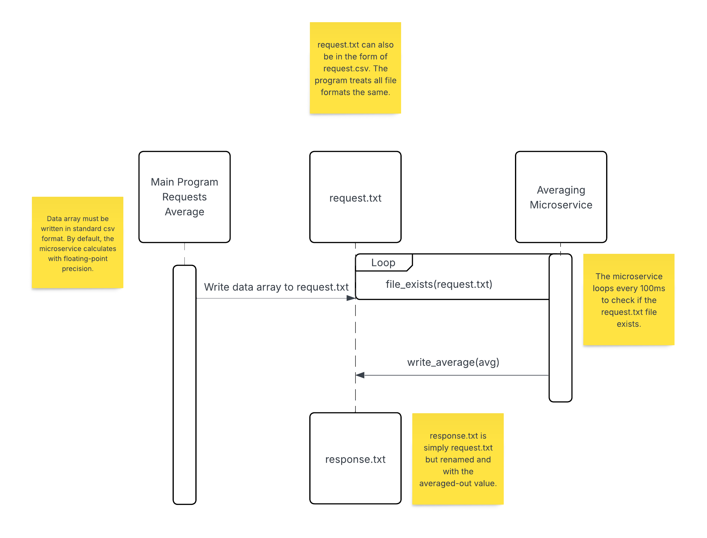

# Averaging Microservice for Weight Lifting

This is a simple microservice to return the average of an array of numerical data. It is written entirely in C++ and is only one file.

**Note**: This program relies on functions that are available starting with C++11. Compiling this program requires a compiler with C++11 features enabled.

## How to Request Data

Requesting data from the microservice requires File IO. Method names for IO slightly vary across languages, but the step for a generic C# example is included below: 

1. Obtain the necessary data that needs to be averaged out into a string. The weight lifting values must be in csv format. A valid string example is: 45,55,55,60,65
2. Write the csv string to a file called request. The file format may either be .txt or .csv, and will work the same regardless. An example call of this is:
```csharp
string request_path = "request.txt";
string sample_data = "45,55,55,60,65";
File.WriteAllText(request_path, sample_data);
```

## How to Receive Data

1. Receiving data is very simple. The microservice will automatically rename the request file to "response" when it calculates and writes the averaged out value. An example call of this is:

```csharp
//Casts avg from a string to float, if necessary
float avg = float(File.ReadAllText("response.txt"));
```

**By default, the program will return the average rounded to the nearest whole number. If more precision is wanted, only one change is needed to the microservice code:
```cpp
//Default precision. Rounded to nearest whole number
//In main():
write_average(response_path, round(avg));

//Altered precision. Will round to the nearest hundredth
write_average(response_path, avg);
```

## UML Diagram


